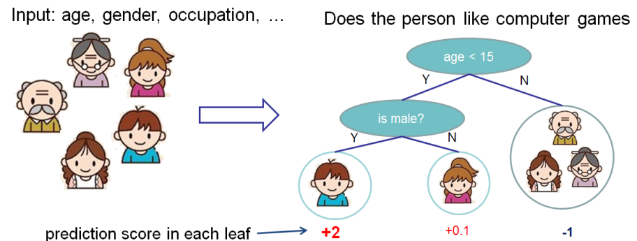
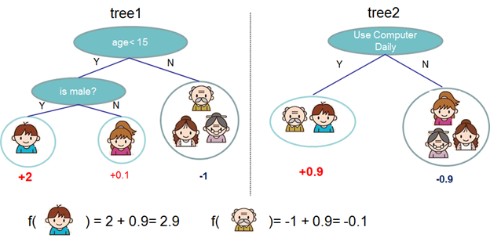

Introduction to the Model of XGBoost
=========================

## The Origin

XGBoost is short for "Extreme Gradient Boosting", where the term "Gradient Boosting" is proposed in the paper _Greedy Function Approximation: A Gradient Boosting Machine_, Friedman. Based on this original model, we incoporated several modifications to make it faster and more robust.

## The General Problem

### Supervised Model

XGBoost is used for supervised learning problems, where we use the training data ``$ x_i $`` to predict a target variable ``$ y_i $``. Our model is a mathematical structure that captures the pattern from the training data. Given the structure, we need to learn the best parameters ``$ \Theta $`` in the model.

### Loss Function

Based on different understanding or assumption of ``$ y_i $``, we can have different problems as regression, classification, ordering, etc. To model different problems, we use a so-called `loss function` to describe how good is our model's performance. The function usually takes two parameters: the true value ``$ y_i $`` and the prediction ``$ \hat{y}_i $``. For example, we can use Rooted Mean Squared Error (RMSE)

`` `math
l(y_i, \hat{y}_i) = (y_i-\hat{y}_i)^2
`` `

for a regression problem, and logistic loss function

`` `math
l(y_i, \hat{y}_i) = y_i\ln (1+e^{-\hat{y}_i}) + (1-y_i)\ln (1+e^{\hat{y}_i})
`` `

for a classification problem. 

### Regularization

Besides we need to control the complexity of our model. A model achieving a perfect loss function score on the training dataset is overfitting it, which means it not only captures the useful pattern, but also the outliers, noise and the specific pattern in the training data. Controlling the complexity can make the model focus on more important and general pattern rather than the unnecessary details. 

### Optimize the Objective

Combining the loss function and the regularization, we have our objective for the supervised learning model as

`` `math
Obj(\Theta) = L(\Theta) + \Omega(\Theta)
`` `

where ``$ L $`` is the loss function, and ``$ \Omega $`` is the regularization term. The first one is making our model being accurate, while the second one is preventing our model being overfitting. We want to have a balance between these two parts when optimizing the objective. The optimization algorithm depends on the structure of our model. The following content will introduce the details.

## Boosting Trees Model

### Classification and Regression Tree

The boosting trees model is a set of classification and regression trees. Here's a simple example of such a model:

We classify the members in thie family into different leaves, and assign them the score on corresponding leaf.

### Tree Ensemble

However a single CART model is not so strong in practice. How about predict with more trees?

Now we are predicting with two trees, by predict on each tree individually and then sum the scores up. Mathematically, we can write our model into the form

`` `math
\hat{y}_i = \sum_{k=1}^K f_k(x_i), f_k \in F
`` `

where ``$ f $`` is a function in the functional space ``$ F $``, and ``$ F $`` is the set of all possible CARTs. Therefore our objective to optimize can be written as

`` `math
obj(\Theta) = \sum_i^n l(y_i, \hat{y}_i) + \sum_{k=1}^K \Omega(f_k)
`` `

### Additive Training

It is not easy to train all the trees at once. Instead, we use the strategy to train them in a sequence so that everytime we train one CART and add it to the model. We note the prediction value at step `t` by ``$ \hat{y}_i^{(t)}$``, so we have 

`` `math
\hat{y}_i^{(0)} = 0\\
\hat{y}_i^{(1)} = f_1(x_i) = \hat{y}_i^{(0)} + f_1(x_i)\\
\hat{y}_i^{(2)} = f_1(x_i) + f_2(x_i)= \hat{y}_i^{(1)} + f_2(x_i)\\
\dots\\
\hat{y}_i^{(t)} = \sum_{k=1}^t f_k(x_i)= \hat{y}_i^{(t-1)} + f_t(x_i)
`` `

Which CART do we want at each step? Of course we want to add the one that minimize our objective.

`` `math
Obj^{(t)} & = \sum_{i=1}^n l(y_i, \hat{y}_i^{(t)}) + \sum_{i=1}^t\Omega(f_i) \\
          & = \sum_{i=1}^n l(y_i, \hat{y}_i^{(t-1)} + f_t(x_i)) + \Omega(f_t) + constant
`` `

Let's consider using RMSE as our loss function

`` `math
Obj^{(t)} & = \sum_{i=1}^n (y_i - (\hat{y}_i^{(t-1)} + f_t(x_i)))^2 + \sum_{i=1}^t\Omega(f_i) \\
          & = \sum_{i=1}^n [2(\hat{y}_i^{(t-1)} - y_i)f_t(x_i) + f_t(x_i)^2] + \Omega(f_t) + constant
`` `

The form of RMSE is friendly. But other loss functions could be tricky to expand. For convenience we calculate the Taylor expansion of the loss function up to the second order

`` `math
Obj^{(t)} = \sum_{i=1}^n [l(y_i, \hat{y}_i^{(t-1)}) + g_i f_t(x_i) + \frac{1}{2} h_i f_t^2(x_i)] + \Omega(f_t) + constant
`` `

where 

`` `math
g_i &= \partial_{\hat{y}_i^{(t)}} l(y_i, \hat{y}_i^{(t-1)})\\
h_i &= \partial_{\hat{y}_i^{(t)}}^2 l(y_i, \hat{y}_i^{(t-1)})
`` `

So we can remove all the constant at the t-th step and the specific objective is 

`` `math
\sum_{i=1}^n [g_i f_t(x_i) + \frac{1}{2} h_i f_t^2(x_i)] + \Omega(f_t)
`` `

One of the benifit of this definition is as long as the loss function has the first and second order derivative, we can optimized every loss function within the same framework.

### Model Complexity

We have introduced the details in the loss function, next we talk about the regularization term. We want to control the complexity of a tree, thus we need to define it first. We define a tree ``$ f(x) $`` as

`` `math
f_t(x) = w_{q(x)}, w\inR^T, q:R^d\rightarrow \{1,2,\cdots,T\}
`` `

where ``$ w $`` is the vector of scores on leaves, ``$ q $`` is a function assigning each data point to the corresponding leaf and ``$ T $`` is the number of leaves. In XGBoost, we define the complexity as 

`` `math
\Omega(f) = \gamma T + \frac{1}{2}\lambda \sum_{j=1}^T w_j^2
`` `

It is possible to define other form of regularization terms, but this one works well in practice.

### Get the best score on leaf

Now we have the objective value with the ``$ t $``-th tree added:

`` `math
Obj^{(t)} &\approx \sum_{i=1}^n [g_i w_q(x_i) + \frac{1}{2} h_i w_{q(x_i)}^2] + \gamma T + \frac{1}{2}\lambda \sum_{j=1}^T w_j^2\\
&= \sum^T_{j=1} [(\sum_{i\in I_j} g_i) w_j + \frac{1}{2} (\sum_{i\in I_j} h_i + \lambda) w_j^2 ] + \gamma T
`` `

where ``$ I_j = \{i|q(x_i)=j\} $`` is the set of indices of data points assigned to the ``$ j $``-th leaf. Notice that in the second line we have change the index of the summation because all the data points on the same leaf get the same score. We could further compress the expression by defining ``$ G_j = \sum_{i\in I_j} g_i $`` and ``$ H_j = \sum_{i\in I_j} h_i $``:

`` `math
Obj^{(t)} = \sum^T_{j=1} [G_jw_j + \frac{1}{2} (H_j+\lambda) w_j^2] +\gamma T
`` `

In this equation ``$ w_j $`` are independent to each other, the form ``$ G_jw_j+\frac{1}{2}(H_j+\lambda)w_j^2 $`` is quadratic and the best ``$ w_j $`` to minimize it can be solved deterministically:

`` `math
w_j^\ast = -\frac{G_j}{H_j+\lambda}\\
Obj = -\frac{1}{2} \sum_{j=1}^T \frac{G_j^2}{H_j+\lambda} + \gamma T
`` `

**Therefore, given the parameters, the gradients and the structure of the tree, we know how to set the score on each leaf.**

### Learn the tree structure

Our algorithm aims at optimizing the objective, so it also guides us to a good tree structure. We score the structure by ``$ Obj^{(t)} $`` which is mentioned just above. Since we can evaluate the tree, ideally we can enumerate all possible trees and pick the best one. In practice it is impossible, so we enumerate all the trees no deeper than a certain depth greedily.

Specifically we try to split a leaf into two leaves, and the score it gains is 

`` `math
Gain = \frac{1}{2} [\frac{G_L^2}{H_L+\lambda}+\frac{G_R^2}{H_R+\lambda}-\frac{(G_L+G_R)^2}{H_L+H_R+\lambda}] - \gamma
`` `

This formula can be decomposited as 1) the score on the new left leaf 2) the score on the new right leaf 3) The score on the original leaf 4) regularization on the additional leaf.

The regularization in the end can be seen as the minimum increment from this split. In the end, we will prune out the split with a negative gain.

